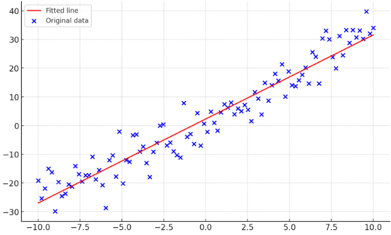

## Linear Least Squares
Before we can talk about Tikhonov regularization, we must first understand the linear least squares algorithm. Suppose we have a set of data points $(x_i, y_i)$ and we want to fit a line to the data.
The line is given by the familiar equation $y = mx + b$. The goal is to find the values of $m$ and $b$ that minimize the sum of the squared residuals (the difference between the data points and the line). The sum of the squared residuals is given by:
$$
\begin{equation}
\label{least-squares}
\chi^2 = \sum_{i=1}^N (y_i - mx_i - b)^2
\end{equation}
$$
To minimize $\chi^2$, we take the partial derivatives with respect to $m$ and $b$ and set them equal to zero:
$$
\begin{equation}
\label{minimize-least-squares}
\frac{\partial \chi^2}{\partial m} = -2 \sum_{i=1}^N x_i (y_i - mx_i - b) = 0
\end{equation}
$$

The value for x that minimizes the sum of the squared residuals is a matrix containing the values for $m$ and $b$ that minimize the sum of the squared residuals. Plotting the solution might look something like this:

## Matrix Formulation
It is bennificial to write the linear least squares problem in matrix form for a couple reasons. First, it is easier to generalize the problem to higher dimensions. Second, it is easier to solve the problem using linear algebra. To do this, let's consider our first equation $\eqref{least-squares}$ again.

We can rewrite this equation in vector form by letting
$$
y = \begin{pmatrix}
y_1 \\ y_2 \\ \vdots \\ y_N
\end{pmatrix}
$$

$$
X = \begin{pmatrix}
x_1 & 1 \\
x_2 & 1 \\
\vdots & \vdots \\
x_N & 1
\end{pmatrix}
$$

$$
\textrm{and} \quad 1 = \begin{pmatrix}
1 \\
1 \\
\vdots \\
1
\end{pmatrix}
$$

So that $mx + 1b$ becomes 
$$
\begin{pmatrix}
mx_1 + b \\
mx_2 + b \\
\vdots \\
mx_N + b
\end{pmatrix}
$$

Then the sum of the squared residuals becomes:
$$
\begin{equation}
\chi^2 = (y - mx - 1b)^T(y - mx - 1b)
\end{equation}
$$

Now if we let $\mathbf{A} = (x^T,1^T)^T$ and $\beta=(m,b)^{T}.$ Then $\mathbf{A}\beta = mx + 1b$. Then the sum of the squared residuals becomes:
$$
\begin{equation}
\chi^{2}=(y-A\beta)^{T}(y-A\beta)
\end{equation}
$$

It turns out that there is a special notation for a matrix of the form $\mathbf{v}^T\mathbf{v}$, it is $\mathbf{v}^T\mathbf{v} = \|\mathbf{v}\|^2$ and is called the norm of $\mathbf{v}$. So we can rewrite the sum of the squared residuals as:
$$
\begin{equation}
\chi^{2}=\|A\beta\ - y|^{2}
\end{equation}
$$

## Extending to Higher Dimensions
Now that we have the linear least squares problem in matrix form, we can easily extend it to higher dimensions. Suppose we have a set of data points $(x_i, y_i, z_i)$ and we want to fit a plane to the data. The plane is given by the equation $z = ax + by + c$. The goal is to find the values of $a$, $b$, and $c$ that minimize the sum of the squared residuals (the difference between the data points and the plane). The notation remains the same, the only difference is that our matrix $\mathbf{A}$ now has three columns instead of two.

## Ill-Conditioned Matrices
A matrix is considered well-conditioned when the number of equations matches the number of unknowns. For example, if we have a system of two equations and two unknowns, then the matrix is well-conditioned. If we have a system of three equations and two unknowns, then the matrix is ill-conditioned. Ill-conditioned matrices are problematic because they are not invertible.

The least squares algorithm can be used to solve ill-conditioned matrices, but it can be sensitive to noise. This is because the least squares algorithm is trying to minimize the sum of the squared residuals. If the matrix is ill-conditioned, then the sum of the squared residuals will be large. This means that the least squares algorithm will try to minimize the sum of the squared residuals by making the residuals as small as possible. This can lead to overfitting.

## Tikhonov Regularization
Tikhonov regularization is a method for solving ill-conditioned matrices. It is similar to the least squares algorithm, but it adds a regularization term to the sum of the squared residuals. The regularization term is a penalty for large values of the unknowns. This helps prevent overfitting.

The Tikhonov regularization algorithm is given by:
$$
\begin{equation}
\chi^{2}=\|A\beta\ - y|^{2}+\lambda\|\Gamma\beta\|^{2}
\end{equation}
$$
  
where $\lambda$ is a regularization parameter and $\Gamma$ is called the tikhonov matrix. The regularization parameter is a trade-off between the sum of the squared residuals and the regularization term. If $\lambda$ is large, then the regularization term will dominate the sum of the squared residuals. If $\lambda$ is small, then the sum of the squared residuals will dominate the regularization term. The tikhonov matrix is a matrix that penalizes large values of the unknowns. It is usually chosen to be the identity matrix.

## Solving the Tikhonov Regularization Problem
The solution to the Tikhonov regularization problem is determined in the same way as the least squares problem $\eqref{minimize-least-squares}$. This time, however, we have to take the partial derivatives with respect to $\beta$ and set them equal to zero, or in other words, we take the gradient of the sum of the squared residuals with respect to $\beta$ and set it equal to zero. The gradient of the sum of the squared residuals is given by:

$$
\begin{equation}
\nabla = 2 \left(A^T (A\beta - y) + \lambda \Gamma^T \Gamma \beta\right) = 0
\end{equation}
$$

The value for $\beta$ that solves this equation is the solution to the Tikhonov regularization problem.

## Example
In hyperspectral imaging problems, we differentiate the spectra of light using a diffractive element. This diffractive element is called a grating. The grating is a periodic structure that diffracts light into different orders. Visually the result is a distinct pattern for every $(x, y, \lambda)$ coordinate. The pattern is called a spectral signature. The spectral signature is a function of the wavelength $\lambda$ and the spatial coordinates $(x, y)$.

We can calibrate the grating by measuring the spectral signatures of a set of known wavelengths at every $(x', y')$ coordinate. Combining this data gives a five-dimensional hypercube of data. The hypercube is given by:
$$
\begin{pmatrix}
\mathbf{x} & \mathbf{y} \\
\mathbf{x'} & \mathbf{y'} & \mathbf{\lambda} \\
\end{pmatrix}
$$

Suppose then that we image a sample with the calibrated grating. We would see a spectral signature for every $(x, y)$ coordinate. Encoded in this data is the spatial and spectral information of the sample. The goal is to extract this information from the data to create a spectral image of the sample.

We can formulate this problem as a matrix equation:
$$
\begin{equation}
\mathbf{y} = \mathbf{A}\beta
\end{equation}
$$

where $\mathbf{y}$ is the spectral image of the sample, $\mathbf{A}$ is the hypercube of data, and $\beta$ is the spectral signature of the sample. The problem is that $\mathbf{A}$ is ill-conditioned. This means that the least squares algorithm will not work. Instead, we can use the Tikhonov regularization algorithm to solve the problem. The value for $\beta$ that solves the Tikhonov regularization problem is the spectral signature of the sample.