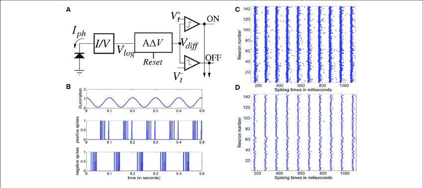

## What is Event Based Imaging?

Event based imaging, also known as neuromorphic imaging, is a new paradigm in imaging that is based on the human eye. The human eye is a great example of an event based sensor. It only sends information to the brain when there is a change in the scene. This is in contrast to traditional cameras that send information about every pixel at a fixed rate. This means that event based cameras can have a much higher temporal resolution than traditional cameras. This technology, while still in its infancy, has found applications in many fields including robotics, autonomous vehicles and now, microscopy.

## How does it work?

Event based cameras are made up of many pixels, each of which is made up of a photoreceptor, a comparator and a memory cell. The photoreceptor is a photodiode that converts light into current. The comparator compares the current to a threshold and if the current is above the threshold, the memory cell is set to 2. If the current is below the threshold, the memory cell is set to 0. The memory cell is then read out by the camera. This process is repeated for every pixel in the camera. The result is a stream of events that can be used to reconstruct the scene.

 
<small>Block Diagram of an Event Based Camera courtesy of <a href="http://dx.doi.org/10.3389/fnins.2017.00454">http://dx.doi.org/10.3389/fnins.2017.00454</a></small>

## Why not use a high speed camera?

High speed cameras are great for capturing fast events, but they have a few drawbacks. First, they are expensive. Second, they require a lot of bandwidth to transfer the data. Third, they require a lot of storage space to store the data. Finally, they require a lot of processing power to process the data. Event based cameras, on the other hand, are comparitivly cheap, low bandwidth, low storage and low processing power. Furthermore they do not rely on a global shutter. This means that they can be made with a much higher resolution than a high speed camera. It also means that they can be made with a much higher dynamic range than a high speed camera.

## How is this useful for microscopy?

There exists several domains of research where dynamic range and temporal resolution are limiting factors in the current state of the art. One such example is the study of inter-cellular communication. In this domain, researchers are interested in studying the communication between cells. This communication occurs via chemical signals that are released by one cell and detected by another cell. These signals can be viewed by genetically altering the cells to express a fluorescent signal. Wheras this allows researchers to view the chemical processes involved, the expression of these fluorescent signals is often very dim. Furthermore, the chemical reactions of interest take place on the order of milliseconds. This means that they are difficult to detect with traditional cameras. Event based cameras, on the other hand, are able to detect these signals with high temporal resolution and high dynamic range.