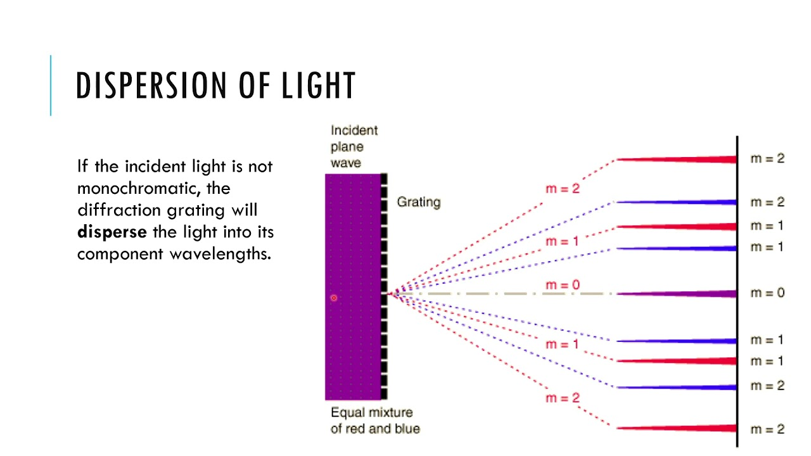
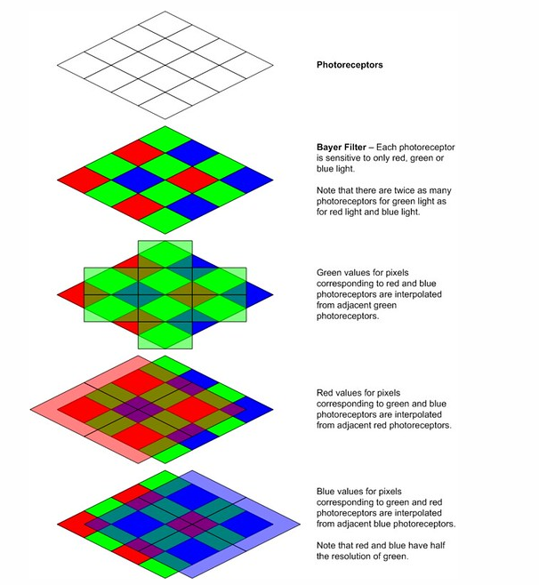

## What is Hyper Spectral Imaging?

Hyper spectral imaging is an imaging technique that allows operators to view a larger spectral range than is possible with traditional cameras. This is accomplished by using a dispersive element to split the light into its constituent wavelengths. This allows operators to view the spectral content of the scene. This is in contrast to traditional cameras that only capture the intensity of the scene, and express color by using a filter array.

## How does it work?

Consider a simple prism. When light enters the prism, it is refracted. The amount of refraction depends on the wavelength of the light. This means that the light is split into its constituent wavelengths. This is known as dispersion. Hyper spectral imaging uses this same concept, but instead of using a prism, it uses a diffraction grating. A diffraction grating is a piece of glass that has many parallel lines etched into it. When light enters the diffraction grating, it is diffracted. The amount of diffraction depends on the wavelength of the light. This creates distinct patterns of light that can be represented as a matrix. This matrix can be inverted to recover the spectral content of the scene.

## How does this differ from traditional cameras?

  

Traditional cameras use a filter array, typically a bayer filter, to capture the color of the scene. These filters work by allowing only certain wavelengths of light to pass through. This means that the camera is only able to capture the intensity of the scene. This is why when you zoom in on a digital image, you can see the individual red, green and blue pixels. Hyper spectral imaging, on the other hand, captures the spectral content of the scene. This means that every pixel in the image contains information about the spectral content of the scene. This allows operators to view the actual spectral content of the scene, and not just an approximation.

## How is this useful for microscopy?

It is often the case that the signals operators are interested in are very close in wavelength. This means that they are difficult to distinguish with traditional cameras. Hyper spectral imaging, on the other hand, allows operators to distinguish between these signals. This is because hyper spectral imaging captures the spectral content of the scene, and not just the intensity of the scene. This means that operators can distinguish between signals that are very close in wavelength.

## How are we using it?

In our particular application, the only way to integrate a traditional camera into the setup would be using a beam splitter to send the light to both the traditional, as well as the event based camera. This would result in a loss of light, as well as a loss of resolution. Using a diffraction grating allows us to convert spectral information in spatial information that the event based camera can capture. This means that we can capture the spectral content of the scene without having to use a beam splitter.
