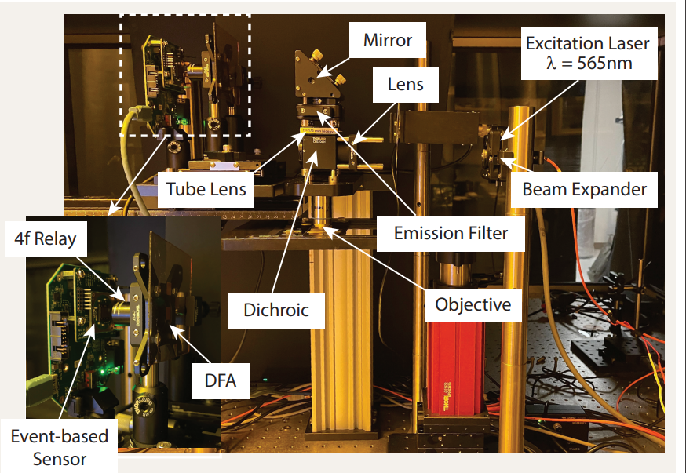

## Motivation

In scientific research, mastering the balance between spatial, spectral, and temporal resolution in microscopy is an imperative yet elusive task. To elaborate, spatial resolution is our ability to discern tiny details; spectral resolution enables us to differentiate between different types of light, such as colors or fluorescent signals; and temporal resolution lets us capture changes over time. A current shortcoming in our technology is the absence of a microscopy technique that can simultaneously excel in all three types of resolution. This poses a significant challenge for researchers striving to understand real-time, complex interactions on a microscopic level.

  

## Potential Impact

Consider a researcher studying fertilization, an intricate process whereby a sperm cell and an egg unite to form a zygote. In an effort to distinguish the different components involved, the scientist may employ fluorescent dyes. These dyes can bind to specific molecules within the sperm or egg and emit different colors when exposed to light, offering a vivid picture of what's happening. This is where spectral resolution becomes critical. However, with current microscope technology, the researcher faces a trade-off. They might be able to see the small scale of this process (spatial resolution) or the fast changes that occur (temporal resolution), but they struggle to simultaneously capture the spectral resolution required.

The same issue arises in the study of photosynthesis, a process where spectral resolution is crucial for understanding how different pigments within plant cells react and contribute to converting light energy into chemical energy. While some pigments absorb light in the blue and red regions of the spectrum, others respond to different wavelengths, and the interplay of these pigments is key to the photosynthesis process. Spectral resolution can therefore provide critical insights, yet its full potential is often compromised in favor of either spatial or temporal resolution.

## Our Solution

Our proposed research aims to bridge this technological gap by merging an Event-Based Sensor (EBS) with a Diffractive Filter Array (DFA). The EBS can capture ultra-fast changes, with temporal resolution limited only by the speed of the associated computing system, potentially offering microsecond-level imaging. Meanwhile, the DFA creates distinct patterns for different light wavelengths, including those emitted by fluorescent dyes or absorbed by photosynthetic pigments. Decoding these patterns allows us to determine the transmitted light's wavelength, thereby significantly improving our spectral resolution capabilities.
This innovative combination holds the potential to create a microscope capable of high-resolution imaging across all three dimensions: spatial, spectral, and temporal, without any compromise
